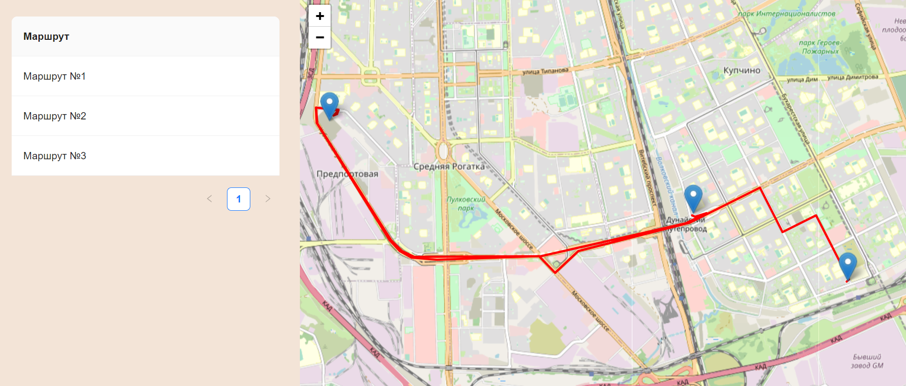

# Приложение "Маршруты на карте"

Приложение "Маршруты на карте" является веб-приложением, которое позволяет пользователям просматривать список маршрутов в виде таблицы и визуализировать выбранный маршрут на карте с помощью полилиний и маркеров. Для реализации использованы библиотеки React, Leaflet,Redux и Ant Design.

## Особенности

- Отображение таблицы со списком маршрутов на левой стороне экрана.
- Отображение карты на правой стороне экрана с использованием Leaflet для визуализации выбранного маршрута с помощью полилиний и маркеров.
- Автоматическое центрирование и масштабирование карты для обзора всего маршрута при выборе маршрута в таблице.
- Получение и отображение полилиний для выбранных маршрутов с использованием API OSRM (Open Source Routing Machine).

## Установка

1. Клонируйте репозиторий:

```bash
git clone https://github.com/iamrosada/Leaflet-react-ts.git
cd Leaflet-react-ts
```

2. Установите зависимости:

```bash
npm install
```

3. Запустите сервер разработки:

```bash
npm run dev
```

Приложение должно быть доступно по адресу ` http://localhost:5173/`.

## Использование

1. После запуска приложения на экране отобразится таблица с доступными маршрутами на левой стороне.

2. Щелкните по строке в таблице, чтобы выбрать маршрут. Выбранный маршрут будет подсвечен, и на карте справа будет отображаться соответствующий маршрут с полилиниями и маркерами.

3. Карта автоматически центрируется и масштабируется, чтобы вместить весь маршрут в видимой области.

4. Для просмотра другого маршрута просто выберите другую строку в таблице, и карта будет обновлена соответствующим образом.


Вы можете настраивать список маршрутов, обновляя массив `routePoints` с вашими данными о маршрутах.
## API-точка

Приложение использует API OSRM для получения полилиний каждого маршрута. API-точка находится по адресу `http://router.project-osrm.org`. 
## Структура папок

- `src/components`: Содержит компоненты React, используемые в приложении.
- `src/reducers`: Содержит редьюсеры Redux для управления состоянием.
- `src/sagas`: Содержит Redux Sagas для обработки асинхронных действий.
- `src/services`: Содержит HTTP-сервис для общения с API OSRM.
- `src/store.js`: Конфигурирует хранилище Redux с промежуточным ПО.
- `src/App.js`: Основной компонент, который отображает таблицу маршрутов и карту.
- `src/index.js`: Точка входа в приложение.

## Используемые технологии

Приложение "Маршруты на карте" создано с использованием следующих библиотек с открытым исходным кодом:

- React - Библиотека JavaScript для создания пользовательских интерфейсов.
- Leaflet - Библиотека JavaScript с открытым исходным кодом для интерактивных карт.
- Ant Design - Набор высококачественных компонентов React.
- TypeScript - Язык программирования TypeScript, добавляющий статическую типизацию к JavaScript.
- Redux (с помощью Redux Toolkit): Для управления состоянием и обработки данных между компонентами.
- Redux Saga: Для обработки асинхронных действий, особенно вызовов API.
- Axios: Для выполнения HTTP-запросов к API OSRM.
- SASS: Препроцессор языка стилей для оформления.



<video src="20230728-2048-20.9599536.mp4" controls title="Title"></video>
## Лицензия

Этот проект лицензирован в соответствии с лицензией MIT - см. файл [LICENSE](LICENSE) для получения дополнительных сведений.

---
